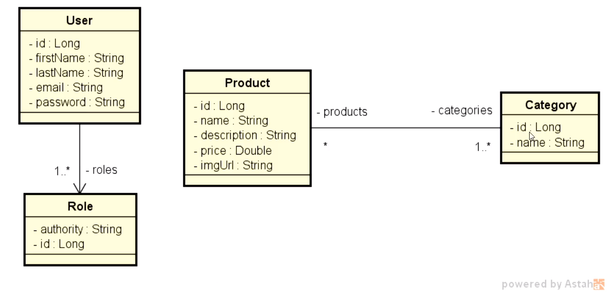
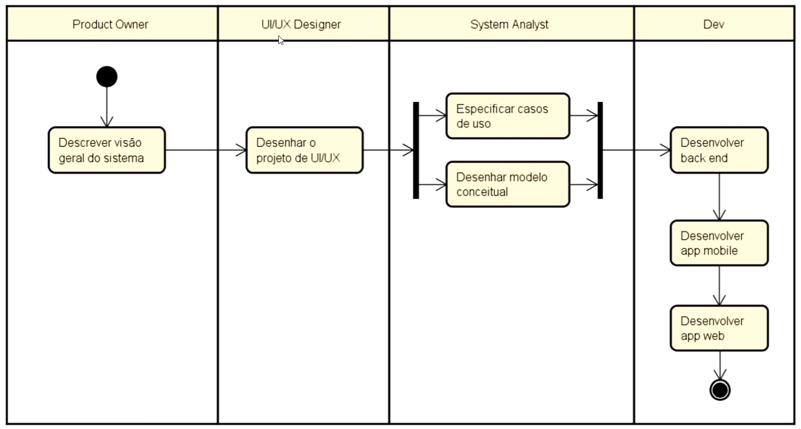

# DScatalog
- Diagramas do projeto

- Processos básicos para a criação de um software do zero

OBS: Vale ressaltar que os papeis estão divididos por profissionais, mas podem ser feito por uma única pessoa, caso tenha o conhecimento necessário.

-> Principais papeis que devem ser feitos pelo Analista de Sistemas.
- Especificar os **Casos de Uso**. Caso de uso pode ser entendido como especificação dos requisitos que tenham **Interação com o Usuário**.
